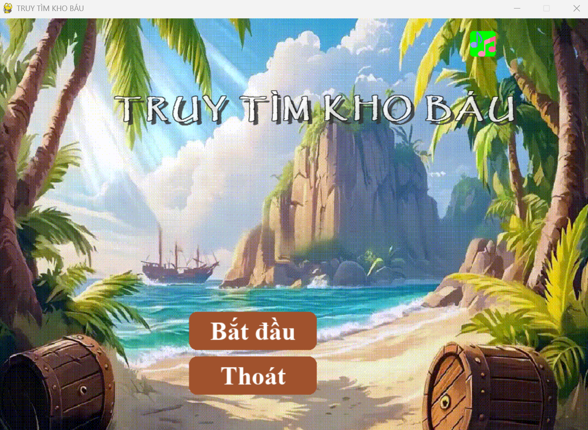
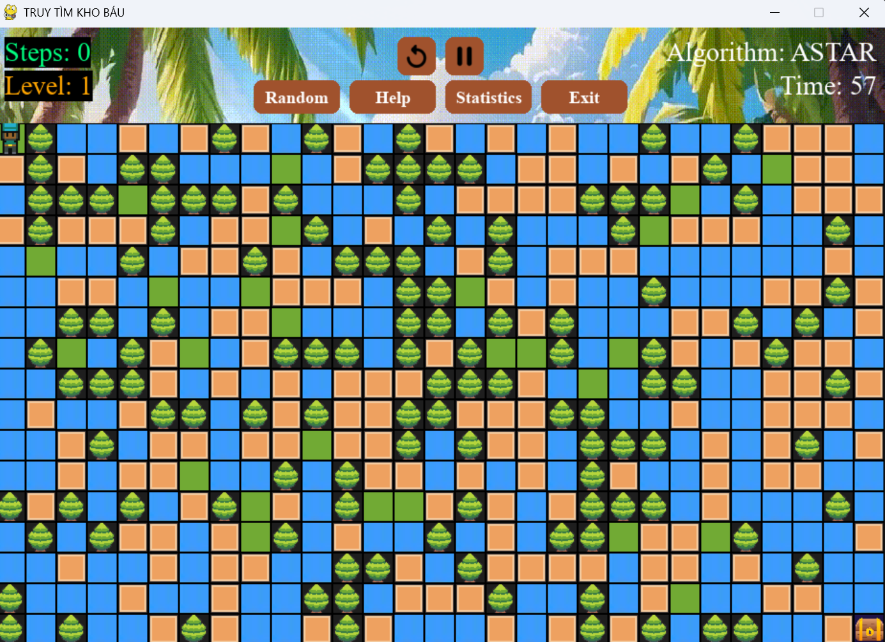

# Treasure Haunting Game Project

## Mô tả


## Project Structure
```
PROJECT_AI/
├── src/
│   ├── main.py           # Entry point
│   ├── game_combined.py  # Game logic
│   ├── thuattoan.py      # AI algorithms
│   ├── player.py         # Player class
│   ├── map_generator.py  # Map generation
│   └── ui.py            # UI components
├── assets/
│   ├── map/             # Game tiles
│   └── sounds/          # Sound effects
└── README.md
```

## Giao diện game
### Menu chính


### Màn hình chơi game


## Demo gameplay
### BFS Pathfinding


### A* Pathfinding


### Beam Search


### And - Or Search


### Backtracking


### Q-Learning


## So sánh thuật toán

### Bảng so sánh


### Phân tích
1. **A*** 


2. **BFS**


3. **Beam Search**


4. **AND-OR Search**


5. **Backtracking**


6. **Q-Learning**


## Công nghệ sử dụng
- Python
- Pygame
- NumPy
