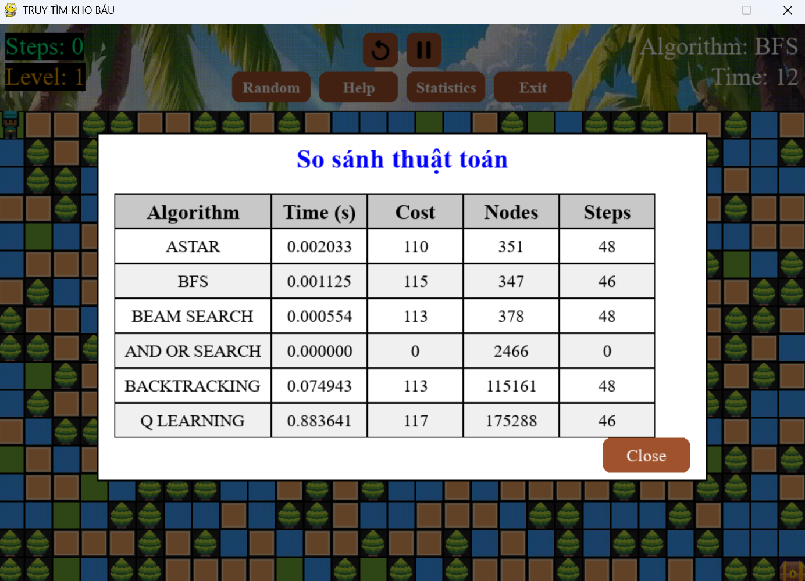

# Treasure Haunting Game Project

## Mô tả
Truy Tìm Kho Báu là một trò chơi phiêu lưu hấp dẫn, nơi bạn sẽ hóa thân thành Blocky – một nhà thám hiểm dũng cảm, tìm kiếm kho báu ẩn giấu trên một hòn đảo bí mật. Với bản đồ được tạo ngẫu nhiên và các thuật toán AI thông minh, trò chơi mang đến trải nghiệm vừa thử thách vừa thú vị, kết hợp giữa khám phá chiến lược và học hỏi công nghệ.

Tính năng nổi bật
Bản đồ hòn đảo bí ẩn:
Mỗi lần chơi, một bản đồ mới được tạo ngẫu nhiên với các loại địa hình đa dạng: cỏ xanh (G), đất khô (D), vùng nước (W) và cây cối (T) là chướng ngại vật không thể vượt qua.
Kho báu (X) nằm ở góc dưới cùng bên phải của bản đồ, chờ bạn khám phá.
Bản đồ được thiết kế đảm bảo luôn có đường đi từ điểm xuất phát (0, 0) đến kho báu, tạo nên sự cân bằng giữa thử thách và khả năng hoàn thành.
Chế độ chơi linh hoạt:
Chế độ thủ công: Sử dụng phím mũi tên hoặc WASD để tự điều khiển Blocky, vượt qua các chướng ngại vật và tìm đường đến kho báu.
Chế độ tự động: Nhấn phím Space để kích hoạt thuật toán AI, quan sát Blocky tự động di chuyển đến kho báu.

Hệ thống cấp độ đầy thử thách:
Trò chơi có 3 cấp độ với thời gian giới hạn giảm dần:
Level 1: 60 giây
Level 2: 40 giây
Level 3: 20 giây
Hoàn thành một cấp độ để tiến lên cấp độ tiếp theo. Nếu hết thời gian, bạn sẽ phải bắt đầu lại từ Level 1.

Trò chơi tích hợp các thuật toán tìm đường thông minh như: A*, BFS, Beam Search, And-Or Search, Backtracking, Q-Learning.

Đối tượng người chơi:
Phù hợp với mọi lứa tuổi, đặc biệt là những người yêu thích phiêu lưu, giải đố và khám phá công nghệ.
Dành cho học sinh, sinh viên hoặc bất kỳ ai muốn tìm hiểu về thuật toán AI một cách trực quan và thú vị.

## Project Structure
```
PROJECT_AI/
├── src/
│   ├── main.py           # Menu chính
│   ├── game_combined.py  # Logic game
│   ├── thuattoan.py      # Thuật toán AI
│   ├── player.py         # Tạo nhân vật
│   ├── map_generator.py  # Tạo map
│   └── ui.py             # Thành phần giao diện
├── assets/
│   ├── map/              # Hình ảnh
│   └── sounds/           # Hiệu ứng âm thanh
└── README.md
```

## Giao diện game
### Menu chính


### Màn hình chơi game


### Màn hình thống kê


## Demo gameplay
### BFS Pathfinding


### A* Pathfinding


### Beam Search


### And - Or Search


### Backtracking


### Q-Learning


## So sánh thuật toán

### Bảng so sánh


### Phân tích
1. **A*** 
Mục đích: Tìm đường đi ngắn nhất từ vị trí bắt đầu đến kho báu, có xét chi phí đi lại và hướng dẫn bằng hàm heuristic.

Cách hoạt động:
Sử dụng hàng đợi ưu tiên (heapq) với trọng số:
f(n)=g(n)+h(n)
g(n): chi phí thực đến đỉnh n.
h(n): ước lượng chi phí còn lại từ n đến đích (heuristic Manhattan).
Mỗi bước chọn node có giá trị f nhỏ nhất để mở rộng.

✅ Ưu điểm:
Tìm được đường đi ngắn nhất nếu h không vượt quá chi phí thật (admissible).
Có thể điều chỉnh tile_cost theo loại địa hình (G: cỏ, D: đất, W: nước...).
❌ Nhược điểm:
Nếu bản đồ lớn hoặc nhiều nhánh, A* dùng nhiều bộ nhớ.
Phụ thuộc vào hàm heuristic.

2. **BFS**
Mục đích: Tìm đường đi ngắn nhất trong bản đồ không có trọng số.

Cách hoạt động:
Duyệt các đỉnh theo từng lớp bằng hàng đợi (deque).
Không sử dụng heuristic.
Lưu cha (parent) để dựng lại đường đi.

✅ Ưu điểm:
Luôn tìm ra đường đi ngắn nhất nếu chi phí giữa các ô bằng nhau.
Dễ triển khai và kiểm chứng đúng sai.
❌ Nhược điểm:
Không tối ưu nếu bản đồ có trọng số (vì không xét được loại đất).
Rất chậm nếu bản đồ rộng, vì duyệt toàn bộ không ưu tiên hướng đi tốt.

3. **Beam Search**
Mục đích: Tìm đường đi tốt bằng cách giới hạn số nhánh mở rộng ở mỗi bước.

Cách hoạt động:
Tương tự A*, nhưng chỉ giữ lại k node tốt nhất theo heuristic tại mỗi bước.
beam_width = 3 mặc định.

✅ Ưu điểm:
Nhanh hơn A*, giảm lượng bộ nhớ.
Có khả năng tìm được đường hợp lý khi không cần tối ưu tuyệt đối.
❌ Nhược điểm:
Không đảm bảo tìm ra đích nếu bị giới hạn quá hẹp.
Có thể bỏ lỡ đường đi đúng do không mở rộng đủ.

4. **AND-OR Search**
Mục đích: Áp dụng trong môi trường không chắc chắn (như ô W có thể trơn trượt).

Cách hoạt động:
Gồm 2 dạng:
OR-node: chọn 1 hành động trong nhiều lựa chọn.
AND-node: tất cả nhánh con đều phải thành công.
Xây dựng cây kế hoạch (plan tree) dựa trên xác suất thành công/thất bại khi di chuyển.

✅ Ưu điểm:
Phù hợp với môi trường bất định (ví dụ: có thể trượt nếu đi qua W).
Cho ra kế hoạch nhiều nhánh, không chỉ là 1 đường đi duy nhất.
❌ Nhược điểm:
Rất khó triển khai, dễ sai.
Không hiệu quả nếu bản đồ không có bất định.
Có thể không tạo được kế hoạch nếu xác suất thấp hoặc đường đi rủi ro cao.

5. **Backtracking**
Mục đích: Tìm 1 đường đi bất kỳ từ start đến goal bằng cách thử-sai và quay lui.

Cách hoạt động:
Đệ quy kiểm tra từng bước.
Nếu đi sai thì quay lui về bước trước và thử hướng khác.

✅ Ưu điểm:
Cực kỳ đơn giản, dễ hiểu, dễ cài đặt.
Không cần biết trước thông tin heuristic hay chi phí.
❌ Nhược điểm:
Dễ bị lặp vô hạn nếu không đánh dấu visited.
Không tìm đường tối ưu.
Rất tốn thời gian trong bản đồ lớn.

7. **Q-Learning**
Mục đích: Cho nhân vật tự học cách đi đến kho báu sau nhiều lần thử.

Cách hoạt động:
Mỗi trạng thái (vị trí) và hành động có một giá trị Q(s,a).


✅ Ưu điểm:
Không cần biết bản đồ trước.
Có thể áp dụng được trong môi trường động hoặc thay đổi.
❌ Nhược điểm:
Cần huấn luyện nhiều lần (default episodes=1000).
Có thể bị "kẹt" nếu không khám phá tốt (epsilon quá thấp).

## Công nghệ sử dụng
- Python
- Pygame
- NumPy
